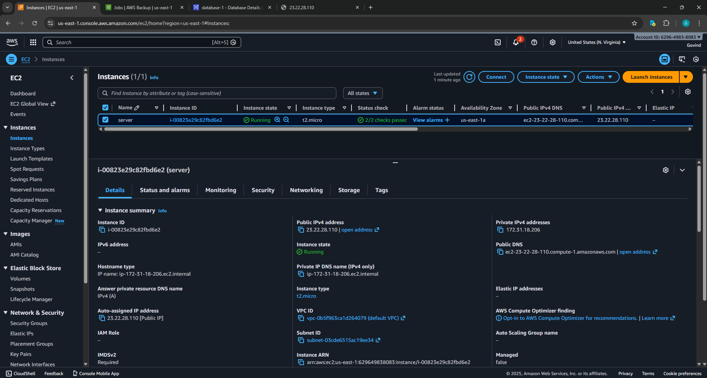
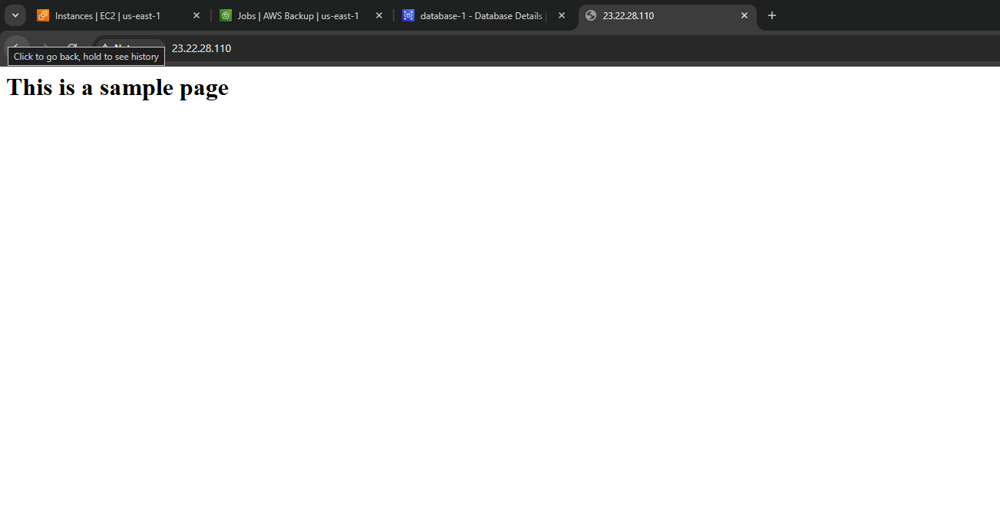
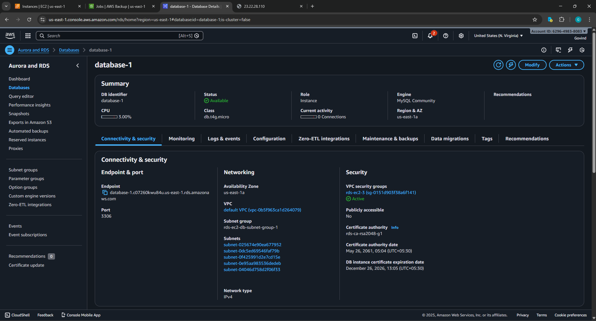
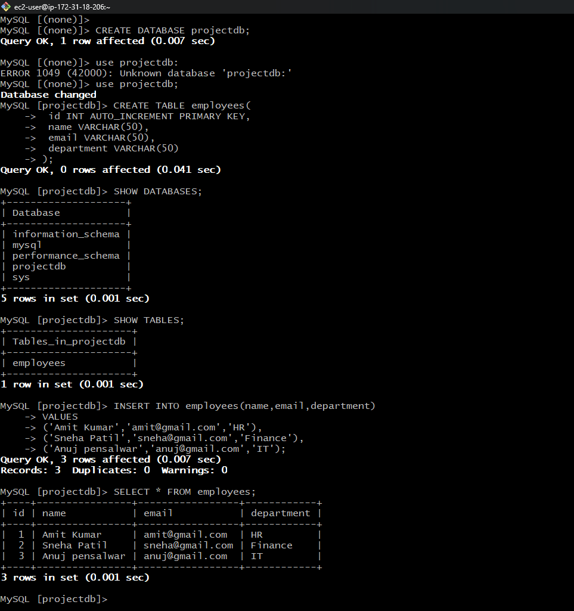
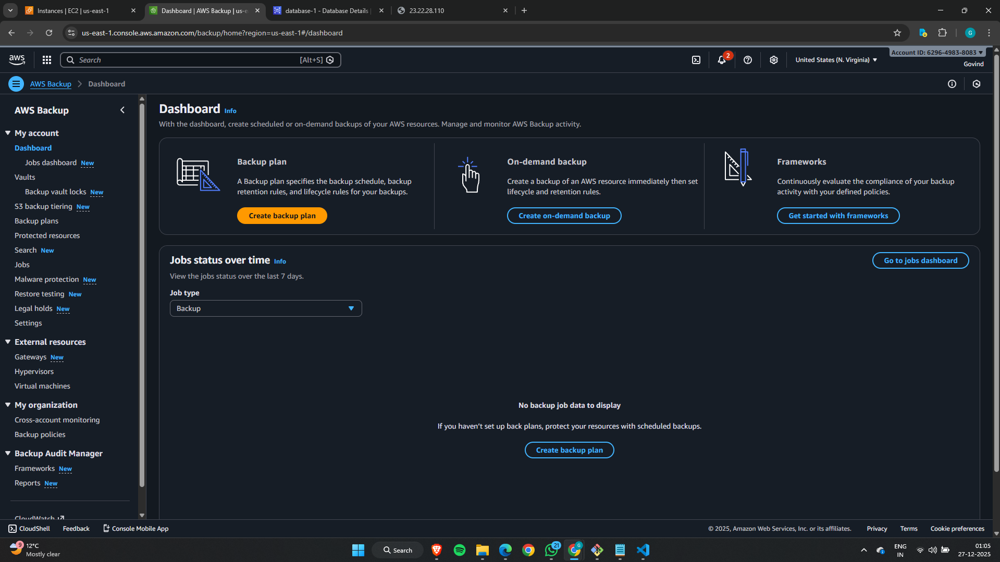
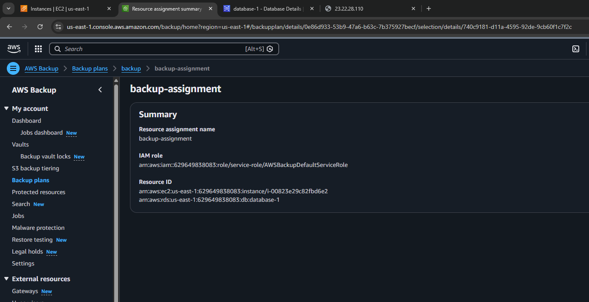
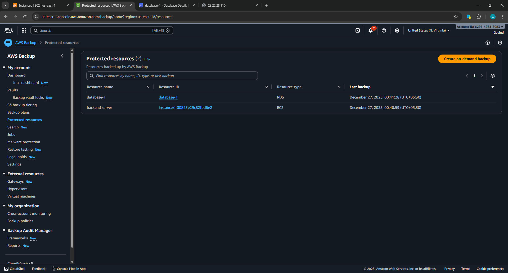
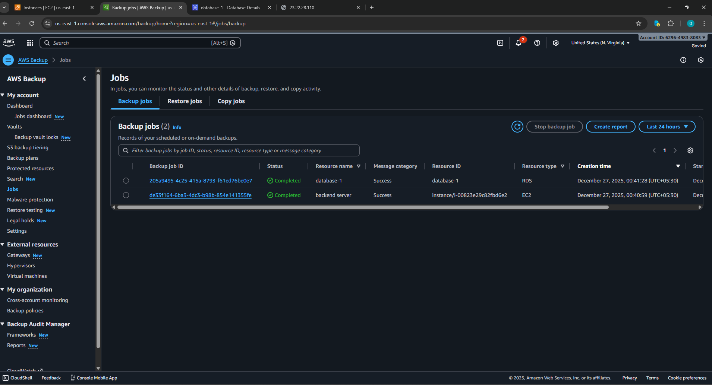
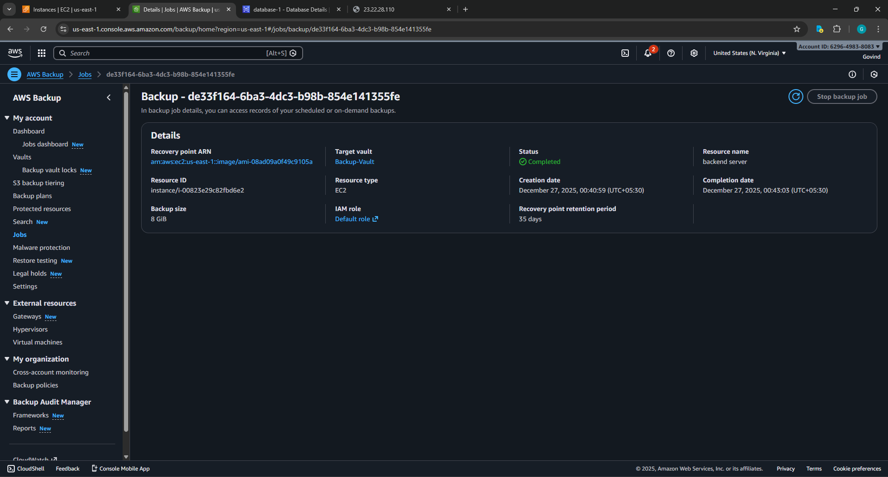
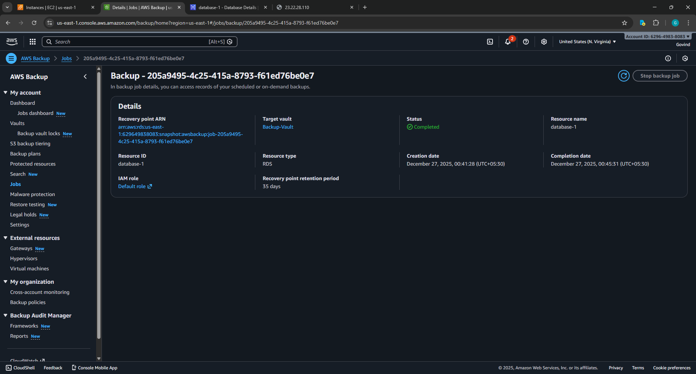

# AWS Backup for EC2 and RDS

## Objective
This project demonstrates how to configure automated backup and recovery for AWS resources using AWS Backup.  
The setup includes:
- Launching one EC2 instance
- Launching one RDS database
- Creating a centralized AWS Backup plan
- Validating backup using on-demand testing

---

# 1. Infrastructure Setup

## 1.1 Launch EC2 Instance
A Linux EC2 instance was launched (Amazon Linux 2)
The instance was configured and connected successfully.

### Screenshot: EC2 Running

---

## 1.2 Configure EC2 Test Data / Web Server
A sample web server or text file was created to ensure there was real data to protect.

### Screenshot: EC2 Test Page / File

---

## 1.3 Launch RDS Instance
An RDS instance (MySQL / PostgreSQL) was launched with required database configuration.

### Screenshot: RDS Running

---

## 1.4 Create Test Database and Data
A sample database and table were created and populated with test records.

### Screenshot: RDS Test Database / Table

---

# 2. AWS Backup Configuration

## 2.1 Open AWS Backup Console
AWS Backup service was opened from AWS Console.

### Screenshot: AWS Backup Dashboard

---

## 2.2 Create Backup Vault
A Backup Vault was created (or default vault used) to securely store recovery points.

### Screenshot: Backup Vault Created

---

## 2.3 Create Backup Plan
A Backup Plan was created with:
- Backup frequency
- Retention period
- Lifecycle rules (if required)
- Selected vault

### Screenshot: Backup Plan Configuration

---

## 2.4 Assign Resources to Backup Plan
Both EC2 and RDS resources were added to the backup plan using resource assignments.

### Screenshot: Resource Assignment

---

# 3. Validation and Testing

## 3.1 Trigger On-Demand Backup
An on-demand backup was triggered to immediately test the backup setup for EC2 and RDS.

### Screenshot: On-Demand Backup Creation

---

## 3.2 Verify Backup Jobs
Backup jobs were verified to ensure that backup execution started and completed successfully.

### Screenshot: Backup Jobs Completed

---

## 3.3 Verify Recovery Points

### EC2 Recovery Point
Recovery point was successfully created for EC2.

### RDS Recovery Point
Recovery point was successfully created for RDS.

---

# Deliverables

### Screenshots Included
- EC2 Instance Running
- EC2 Test Page / File
- RDS Instance Running
- RDS Test Data
- AWS Backup Dashboard
- Backup Vault
- Backup Plan
- Resource Assignments
- On-Demand Backup Trigger
- Backup Jobs
- EC2 Recovery Points
- RDS Recovery Points

---

# Short Report

## Steps Followed
1. Launched EC2 and configured test data
2. Launched RDS and created database with sample records
3. Opened AWS Backup
4. Created Backup Vault
5. Created Backup Plan
6. Assigned EC2 and RDS resources
7. Triggered on-demand backup
8. Verified backup jobs and recovery points

## Key Configuration Details
- Backup frequency: As defined in backup rule
- Retention period: Set inside backup plan
- Backup vault: Custom / Default vault used
- Resource assignment: EC2 + RDS

## AWS Services Used
- EC2 Console
- RDS Console
- AWS Backup:
  - Dashboard
  - Backup Plans
  - Vaults
  - Protected Resources
  - Backup Jobs
  - Recovery Points

## Issues Faced and Fixes
- Backup scheduling delay was handled using on-demand backup
- Ensured correct AWS region while viewing backups
- IAM permission dependencies were automatically handled by AWS Backup role